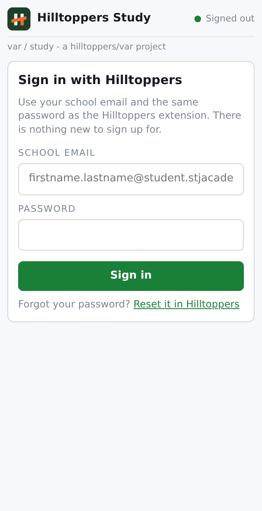
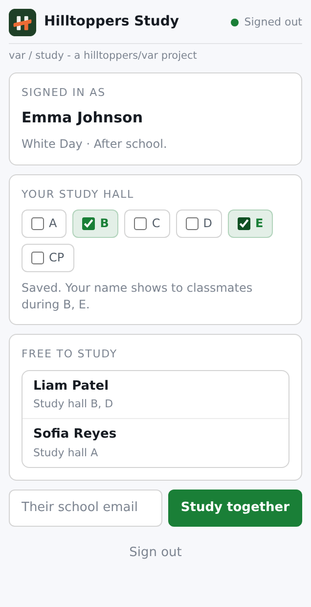
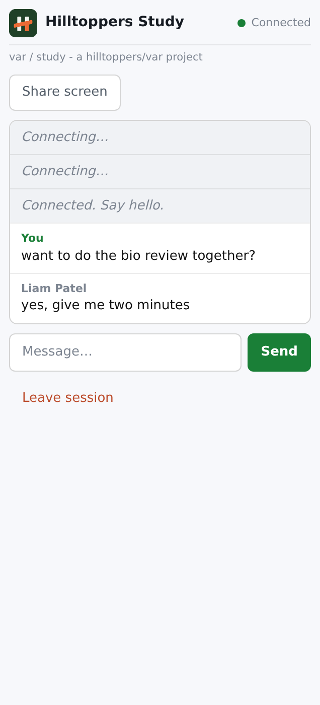
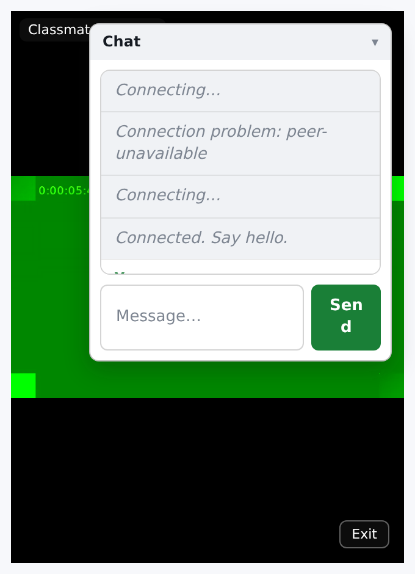

# Hilltoppers Study

A Hilltoppers Topping for studying with one classmate at a time: a text chat
and a screen share, side by side, while you both work. It is a plain website
that the extension embeds in the Topping panel, so nothing here touches the
extension itself.

- The website (this repo, served by GitHub Pages) is the Topping.
- The Worker (`worker/`) signs students in, keeps who is free to study, and
  authorizes rooms.
- Chat and screen sharing go straight between the two browsers. The Worker
  never sees a message or a pixel.






## Signing in

There is no new account and no new password. Study signs in against the same
Firebase project the Hilltoppers extension uses, so a student types their school
email and the password they already have. Study creates nothing, stores no
password, and cannot reset one; the **Forgot your password?** link says to reset
it in Hilltoppers, because that is where the password lives.

- The email must end in `@student.stjacademy.org`. Staff addresses are refused:
  this is a student tool.
- The Worker verifies the Firebase ID token itself (signature, issuer, audience,
  expiry) against Google's published keys before it trusts anything. It never
  receives a password.
- The name shown to classmates is derived from the email
  (`firstname.lastname@…` becomes `Firstname Lastname`). Everyone already knows
  each other's school email, so there is nothing to type and nothing to fake.

## How a session works

1. A student ticks the blocks in which they have **study hall** (any of A–E and
   CP; more than one is fine).
2. During that block their name appears in everyone's **Free to study** list.
   Between blocks and after the last one the list shows everyone who has marked
   a study hall, since the school day is over. On a holiday or weekend it shows
   the same, because no block is running.
3. Tapping a name, or typing a classmate's school email at any time, starts an
   invite.
4. The invited side accepts. Only one side dials through PeerJS, so exactly one
   chat channel and one screen call exist per room.
5. Either side can share a screen. A room is 1:1 and ends after two hours.

The schedule is read from the same published files the extension reads
(`day_type.json` and `special_days.json` on `hilltoppers.pages.dev`), so Green
and White days, late starts, custom days and holidays all match. The bell times
are copied from the extension's own `schedule/*.json`.

## Look and feel

The Topping matches the Hilltoppers popup rather than inventing its own style:
the same light surface (`#f7f8fb` behind white cards), the same SJA green
accent (`#1a7f37`), the same system font stack, and the same card, button and
input shapes and border colours. A classmate who opens it should not be able to
tell it was built separately.

The mark (`logo.png`, from `favicon.png`) sits beside the title, and a hairline
under the header carries the credit line `var / study - a hilltoppers/var
project`. `favicon.png` is also the tab icon and `apple-touch-icon.png` the
home-screen icon; the three are scaled from the same source square.

## Layout

The panel is about **318 × 360 px**. The page is built to that width: the layout
uses no fixed pixel widths, text wraps, and the chat and buttons stay inside the
card. It follows the Topping conventions in the Hilltoppers repo:

- `[data-topping-content]` wraps everything and is measured by `resize.js`,
  which reports the natural height back to the extension for **Fit content**
  height mode.
- The page is embeddable in an iframe (no `X-Frame-Options`, no framing CSP).
- Because the Topping iframe is `sandbox="allow-scripts ..."` without
  `allow-modals`, `window.confirm`/`alert` are blocked, so confirmations are
  in-page overlays. Every `localStorage` access is guarded so the app still runs
  even where storage is refused.

## Screen sharing needs one change in Hilltoppers

The extension embeds Toppings in an iframe that does **not** currently carry
`allow="display-capture"`. In a cross-origin frame, the browser then refuses
`getDisplayMedia` with:

> NotAllowedError: Access to the feature "display-capture" is disallowed by
> permissions policy.

So the screen share cannot start until the Topping iframe is granted that
permission. The fix is one attribute in
`chrome-extension/src/popup/Toppings.tsx`:

```diff
 <iframe ref={frame} src={source.href} title={`${topping.name} topping`}
+  allow="display-capture"
   sandbox="allow-scripts allow-same-origin allow-forms allow-popups allow-popups-to-escape-sandbox"
   referrerPolicy="no-referrer" />
```

Until then the app is fully usable for chat and the Share button explains that
screen sharing is blocked, rather than failing silently.

## Fill tab

Under the picture there is a **Fill tab** button. It is not the browser's
Fullscreen API: the picture is stretched to the height of the tab and the page
scrolls, so it also works inside the Topping iframe, where a cross-origin frame
is not allowed to go fullscreen. While it is on, the chat becomes a small panel
floating over the picture, which the viewer can drag out of the way or collapse,
and the rest of the page is hidden. The person sharing sees **Sharing tab** in
place of their own picture, rather than a mirror of the window they are already
looking at.

Fill mode sets a viewport height on the picture only, never on
`[data-topping-content]`, so the height reported to the extension still shrinks
back when the mode is left.

## Relay (TURN), for school networks

Even once the iframe allows capture, two browsers still have to find a network
path to each other. On many school networks they cannot: the network blocks the
direct peer-to-peer route. Chat usually still works because it is small, but a
screen share is a continuous stream and cannot, so it looks like "sharing is
broken on school wifi".

The fix is a relay, or TURN, server. The Worker hands out relay credentials from
`/api/turn`, and the app adds them to the connection automatically. The provider
key stays on the server; students only ever get a credential, never the key.

### Recommended: Metered (free, no credit card)

Metered's free plan includes 20 GB of relay traffic a month and asks only for an
email address. It is the recommended option because Cloudflare's TURN service
requires billing details on the account.

1. Sign up at **metered.ca** → **Open Relay** and copy the **API key** from the
   dashboard.
2. Add it to the Worker as a secret: **Settings → Variables and Secrets →
   Add → Secret**, named `TURN_API_KEY`.

Nothing else is needed; the Worker calls Metered's credential endpoint itself.

### Also supported

The Worker checks these in order and uses the first that is configured:

| Secret | Use it for |
|---|---|
| `TURN_URLS`, `TURN_USERNAME`, `TURN_CREDENTIAL` | A fixed relay server: self-hosted coturn, or the "Show ICE Servers Array" values from Metered's TURN dashboard. `TURN_URLS` is comma-separated and must contain the `turn:` entries — a `stun:` url cannot relay and is refused. |
| `TURN_API_KEY` | Metered's credential endpoint, as above. |
| `TURN_KEY_ID`, `TURN_API_TOKEN` | Cloudflare Calls TURN (**Realtime → TURN**). Requires billing details. |

While none are set, `/api/turn` answers `{"configured":false}` and the app
quietly falls back to the public PeerJS cloud, which is fine on an open network.
Configure one and reload the Topping to switch it on. To check from a browser,
open `https://hilltoppers-study.amos-donn.workers.dev/api/turn` — you should see
a list of `iceServers` containing a `turn:` entry, not an empty one.

A half-configured relay is refused rather than passed on. If `/api/turn` answers
`configured:false` with a `reason` saying there is no `turn:` url, the secret is
set but points at a `stun:` server — edit it to the provider's `turn:` entries.
Reporting it as ready would be worse: the app would stop falling back to the
public cloud and then fail anyway, which looks identical to "sharing is broken".

(With a terminal, secrets are set with
`npx wrangler secret put TURN_API_KEY --config ../wrangler.toml`, from
`worker/`.)

## Deploy

These are the steps that match the current Cloudflare setup: Worker
`hilltoppers-study`, D1 database `studystream-sessions`
(`7cfc650d-c260-4857-b3cc-8f23b36223cb`), binding `DB_BINDING`, and the API at
`https://hilltoppers-study.amos-donn.workers.dev`.

### 1. Worker

`wrangler.toml` lives at the **repository root** because Cloudflare runs the
build from the repo root. It points `main` at `worker/src/index.ts`.

In the Cloudflare dashboard, the Worker's build (Settings → Build) must be:

- **Root directory:** the repository root (leave empty)
- **Build command:** `cd worker && npm ci`
- **Deploy command:** `npx wrangler deploy --config ../wrangler.toml`

If it is left as a static site / assets Worker, the Worker serves the repo files
instead of running the API and `/api/health` returns a bare 404.

**The database tables are created automatically.** The Worker runs the
statements in `worker/schema.sql` on its first request, so there is no
`wrangler d1 execute` step and no terminal needed. After the build is set and the
secret below is added, open
`https://hilltoppers-study.amos-donn.workers.dev/api/setup` once to create the
tables (any API call does it too).

**The signing secret is the one thing to add by hand.** In the dashboard:
Worker → **Settings → Variables and Secrets → Add → Secret**, name
`SESSION_HMAC_KEY`, value any random string of 32+ characters. Without it the
Worker answers `Hilltoppers Study is not configured yet`.

If you changed the binding name or database id, keep `wrangler.toml` and the
dashboard in sync. `DB_BINDING` in `wrangler.toml` must match the variable name
the dashboard shows on the Worker's settings page.

`ALLOWED_ORIGINS` in `wrangler.toml` must list the site's origin
(`https://amos-donn.github.io`) so the browser is allowed to call `/api`.

<details>
<summary>Deploying with a terminal instead (optional)</summary>

```sh
cd worker
npm ci
npx wrangler d1 execute studystream-sessions --config ../wrangler.toml --remote --file=schema.sql
npx wrangler secret put SESSION_HMAC_KEY --config ../wrangler.toml
npm run deploy
```

The `d1 execute` line is optional: the Worker creates the tables itself.
</details>

### 2. Website

`config.js` already points at the deployed Worker and the Hilltoppers Firebase
project. Serve this repo with GitHub Pages (Settings → Pages → Deploy from a
branch → `main` / root). The Topping URL is the Pages URL.

### 3. Add it to Hilltoppers

Topping Bar → **Preview a Topping**, paste the Pages URL, choose a height mode,
and open it in the popup.

## Checks

```sh
cd worker
npm run typecheck                          # no errors
npm run build                              # wrangler deploy --dry-run
node scripts/manual-test.mjs <worker-url>  # API end to end
```

`manual-test.mjs` signs in two throwaway students against the Hilltoppers
Firebase project, exercises the API, and deletes the accounts afterwards.

There are no browser tests. The UI was checked by hand and with a scripted
browser at the Topping width: sign-in (including a wrong password and a
non-school email), study-hall blocks, the free-to-study list across two
accounts, invite and accept, and the layout at 318px with no horizontal
overflow. Screen capture itself needs a real display and the
`allow="display-capture"` change above.

## Privacy

- No password, email content, or message content is stored by Study. An account
  is the school email plus the blocks the student marked; sign-in is delegated
  to the Hilltoppers Firebase project.
- Chat and screen media are peer to peer. The Worker learns who is in a room
  together, and only until the room ends.
- The PeerJS identity of each student is a hash, so the Firebase uid is not
  exposed on the signalling network.
- `/api` is rate-limited, and stale students and rooms are swept hourly.
